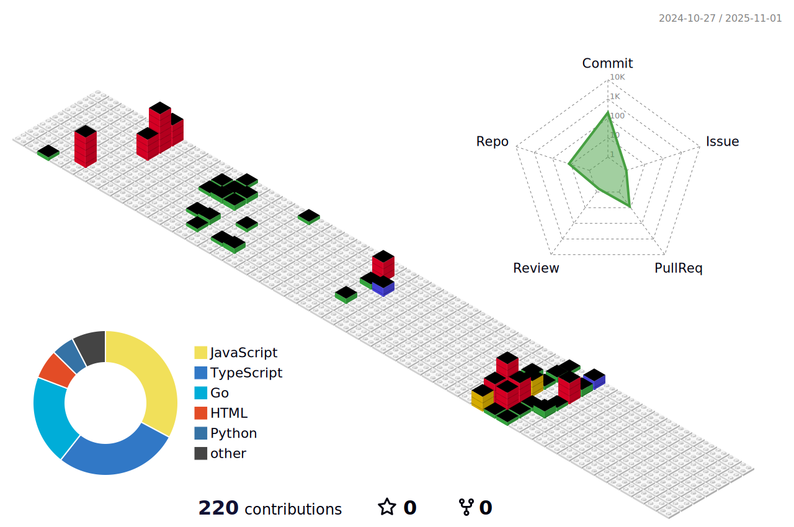

<!--

 
  

  
  
  
 

 

  
  
  
  
  

  
-->

📫 How to reach me **win78py@gmail.com**

#### Languages and Tools:

<!--  

-->

<!--

-->

<!--  -->
<!--  -->

<!-- 

 -->

<!-- 

-->

<!--

-->
 

 
